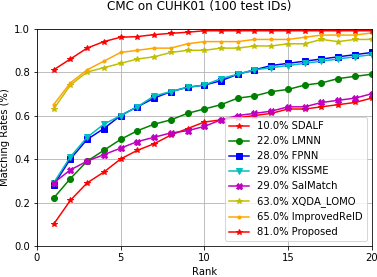

# A Simple Tool for Ploting CMC Curve
## [Demo](./demo.ipynb)
### __CMC Class__: 3 Inputs (1 required, 2 optinal)
1. __cmc_dict:__ python dictionary of cmc values. Key is the method name (string). Value is the cmc values. 
    * __The last dictionary item__ must be set to your proposed method's result.
```python
cmc_dict ={
    'SDALF': [0.10, 0.21, 0.29, 0.34, 0.40, 0.44, 0.47, 0.51, 0.54, 0.57],
    'ImprovedReID': [0.65, 0.75, 0.81, 0.85, 0.89, 0.90, 0.91, 0.91, 0.93, 0.94],
    'Proposed Method': [0.65, 0.75, 0.81, 0.85, 0.89, 0.90, 0.91, 0.91, 0.93, 0.94]
}
```
2. __color__ (optional): a list of colors for ploting (_the __first color__ will be used for your proposed method's cmc curve_). detail document for color is [here](https://matplotlib.org/api/colors_api.html)
    * 7 default colors is alrady set up in the class: `color = ['r','g','b','c','m','y','orange','brown']`
3. __marker__ (optional): a list of markers for ploting (_the __first marker__ will be used for your proposed method's cmc curve_). detail document for marker is [here](https://matplotlib.org/api/markers_api.html).
    * 7 default marker is alrady set up in the class: `marker = ['*','o','s','v','X','*','.','P']`


```python
from CMC import CMC
cmc = CMC(cmc_dict)

#custimised color and marker
new_color = ['r','g','b','c','m','y','orange','brown']
new_marker = ['*','o','s','v','X','*','.','P']
cmc = CMC(cmc_dict,color=new_color,marker=new_marker)
```

## **Method 1 `plot`**: 1 required, 4 optional
1. __title:__ title of the cmc curve (string)
2. __rank__(optional): top *n* value for ploting (integer), default is 20
3. __xlabel__ (optional): label for x-axis (string), default is `Rank`
4. __ylabel__ (optional): label for y-axis (sting). default is `Matching Rates (%)`
5. __show_grid__ (optional): turn on or off grid in the graph (boolean). default is `True`


```python
#simple plot
cmc.plot(title = 'CMC on CUHK01 (100 test IDs)')
```



```python
#custimised color and marker
cmc.plot(title = 'CMC on CUHK01', rank=10,
         xlabel='Rank Score',
         ylabel='Recognition Rate', show_grid=False)
```


## **Method 2 `save`**: 2 required, 6+ optional
### Required
1. __title:__ title of the cmc curve (string)
2. __filename:__ filename for saved figure *(string)*

### Optional
1. __rank__(optional): top *n* value for ploting (integer), default is 20
2. __xlabel__ (optional): label for x-axis (string), default is `Rank`
3. __ylabel__ (optional): label for y-axis (sting). default is `Matching Rates (%)`
4. __show_grid__ (optional): turn on or off grid in the graph (boolean). default is `True`
5. __save_path__ (optional): figure saving directory (default is the current working directory)
6. __format__ (optional): figure saving fomate (**jpg, jpeg, png, pdf, ps, eps** and **svg**), default is **png**
7. other parameters from [pyplot.savefig](https://matplotlib.org/api/_as_gen/matplotlib.pyplot.savefig.html) can be used here


```python
# simple save
cmc.save(title = 'CMC on CUHK01 (100 test IDs)', filename='cmc_result_1')
```

```python
#custimised save
cmc.save(title = 'CMC on CUHK01', filename='cmc_result_2',
         rank=10,xlabel='Rank Score', ylabel='Recognition Rate', 
         show_grid=False, format='png')
```
